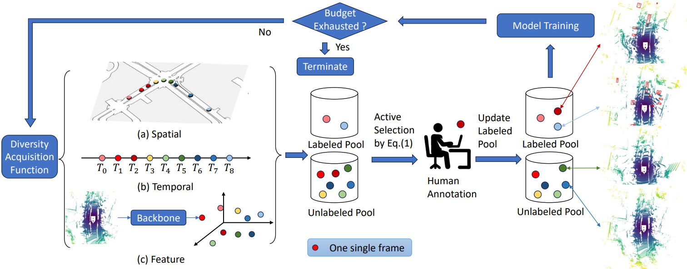

# **Exploring Diversity-based Active Learning for 3D Object Detection in Autonomous Driving**

This repository is an official implementation for our T-ITS paper [\[Arxiv\]]([arxiv.org/abs/2205.07708]([https://arxiv.org/abs/2205.07708](https://arxiv.org/abs/2205.07708)))

**Jinpeng Lin<sup>1</sup>** &nbsp; **Zhihao Liang<sup>2</sup>** &nbsp; **Shengheng Deng<sup>2</sup>** &nbsp; **Lile Cai<sup>3</sup>** &nbsp; **Tao Jiang<sup>4</sup>**  &nbsp;   **Tianrui Li<sup>1</sup>** &nbsp; **Kui Jia<sup>2</sup>** &nbsp;  **Xun Xu<sup>3</sup>** 

<br>

<sup>1</sup>Southwest Jiaotong University<br><sup>2</sup>South China University of Technology &nbsp; <br>
<sup>3</sup>Institute for Infocomm Research, A*STAR &nbsp; <br><sup>4</sup>Chengdu University of Information Technology &nbsp; 

<br>

### Overview



## 1. Installation

Please refer to [INSTALATION.md](INSTALLATION.md).

## 2. Prepare data

Please refer to [PREPARE_DATA.md](PREPARE_DATA.md).

## 3.Runing

- select info

  ```
  # active select
  python tools/active_select.py $CONFIG_PATH --work_dir $WORK_DIR --budget $INCREMENTAL_BUDGET
  
  # example: spa+tem:
  python tools/active_select.py examples/active/cbgs_spatial_temporal.py --work_dir work_dir --budget 600
  
  # modify hyperparameters such as normalize, cost_b, cost_f in the following files:
    det3d/selectors/spatial_temporal_selector.py
  ```

- create dbinfo:

  ```
  python tools/create_data.py nuscenes_data_prep --root_path=$NUSCENES_TRAINVAL_DATASET_ROOT --suffix $SUFFIX --version="v1.0-trainval"
  
  # example: spa+tem:
  python tools/create_data.py nuscenes_data_prep --root_path=/Datasets/Nuscenes --suffix spatial_temporal_1200 --version="v1.0-trainval"
  ```

- train

  ```
  bash tools/scripts/train.sh $TASK_DESC $CONFIG $BUDGET $SEED
  
  # example: spa+tem:
  bash tools/scripts/train.sh spatial_temporal_1200 examples/active/cbgs_spatial_temporal.py 1200 42
  ```

- test

  ```
  python tools/dist_test.py $CONFIG_PATH --work_dir $WORK_DIR --checkpoint $CKPT_PATH
  
  # example: spa+tem:
  python tools/dist_test.py examples/active/cbgs_spatial_temporal.py work_dir/spatial_temporal_1200 work_dir/NUSC_CBGS_spatial_temporal_budget_1200_20231121-142055/latest.pth
  ```

For BEVFusion:

1. follow bevfusion/README.md to build dependencies
2. create dbinfo:

```
python tools/create_data.py nuscenes \
    --root-path $root-path --out-dir $out-dir \
    --extra-tag nuscenes --budget $budget \
    --buffer_path $selected_data_idx_buffer

# for example:
python tools/create_data.py nuscenes \
    --root-path /dataset --out-dir /dataset \
    --extra-tag nuscenes --budget 4800 \
    --buffer_path /dataset/buffers/seed42/uwe-seed42.json
```

​			3.train:

```
torchpack dist-run -np $gpu_nums python tools/train.py \
configs/nuscenes/det/transfusion/secfpn/lidar/voxelnet_0p075.yaml \
 --run-dir $dirs

torchpack dist-run -np 4 python tools/train.py \
configs/nuscenes/det/transfusion/secfpn/camera+lidar/swint_v0p075/convfuser.yaml \
 --model.encoders.camera.backbone.init_cfg.checkpoint pretrained/swint-nuimages-pretrained.pth \
 --load_from $trained_path \
 --run-dir $out_dirs


# for example:
torchpack dist-run -np 4 python tools/train.py \
configs/nuscenes/det/transfusion/secfpn/lidar/voxelnet_0p075.yaml \
 --run-dir /dataset/runs/uwe4800_seed42/lidar-only

torchpack dist-run -np 4 python tools/train.py \
configs/nuscenes/det/transfusion/secfpn/camera+lidar/swint_v0p075/convfuser.yaml \
 --model.encoders.camera.backbone.init_cfg.checkpoint pretrained/swint-nuimages-pretrained.pth \
 --load_from /dataset/runs/uwe4800_seed42/lidar-only/epoch_20.pth \
 --run-dir /dataset/runs/uwe4800_seed42/fus
```

4. test

```
torchpack dist-run -np $gpu_nums python tools/test.py \
configs/nuscenes/det/transfusion/secfpn/camera+lidar/swint_v0p075/convfuser.yaml \
  $ckpt_path \
  --eval bbox --eval-options "jsonfile_prefix=$out_dirs"

# for example:
torchpack dist-run -np 4 python tools/test.py \
configs/nuscenes/det/transfusion/secfpn/camera+lidar/swint_v0p075/convfuser.yaml \
  /dataset/runs/uwe4800_seed42/fus/latest.pth \
  --eval bbox --eval-options "jsonfile_prefix=/dataset/runs/uwe4800_seed42/fus/val/"  
```

## 4. Contributors

[Linkon87](https://github.com/Linkon87)     [lzhnb](https://github.com/lzhnb)     [AndlollipopDE](https://github.com/AndlollipopDE)

## 5. Citation

```
@misc{lin2024exploringdiversitybasedactivelearning,
      title={Exploring Diversity-based Active Learning for 3D Object Detection in Autonomous Driving}, 
      author={Jinpeng Lin and Zhihao Liang and Shengheng Deng and Lile Cai and Tao Jiang and Tianrui Li and Kui Jia and Xun Xu},
      year={2024},
      eprint={2205.07708},
      archivePrefix={arXiv},
      primaryClass={cs.CV},
      url={https://arxiv.org/abs/2205.07708}, 
}
```

## 6. Acknowledgement

* [Det3D]([V2AI/Det3D: World's first general purpose 3D object detection codebse. (github.com)](https://github.com/V2AI/Det3D))  
* [BevFusion]([mit-han-lab/bevfusion: [ICRA'23\] BEVFusion: Multi-Task Multi-Sensor Fusion with Unified Bird's-Eye View Representation (github.com)](https://github.com/mit-han-lab/bevfusion))
* [PPAL]([ChenhongyiYang/PPAL: [CVPR 2024\] Plug and Play Active Learning for Object Detection (github.com)](https://github.com/ChenhongyiYang/PPAL))
* [CALD]([we1pingyu/CALD: The official implementation of CALD: Consistency-basd Active Learning for Object Detection (github.com)](https://github.com/we1pingyu/CALD))
